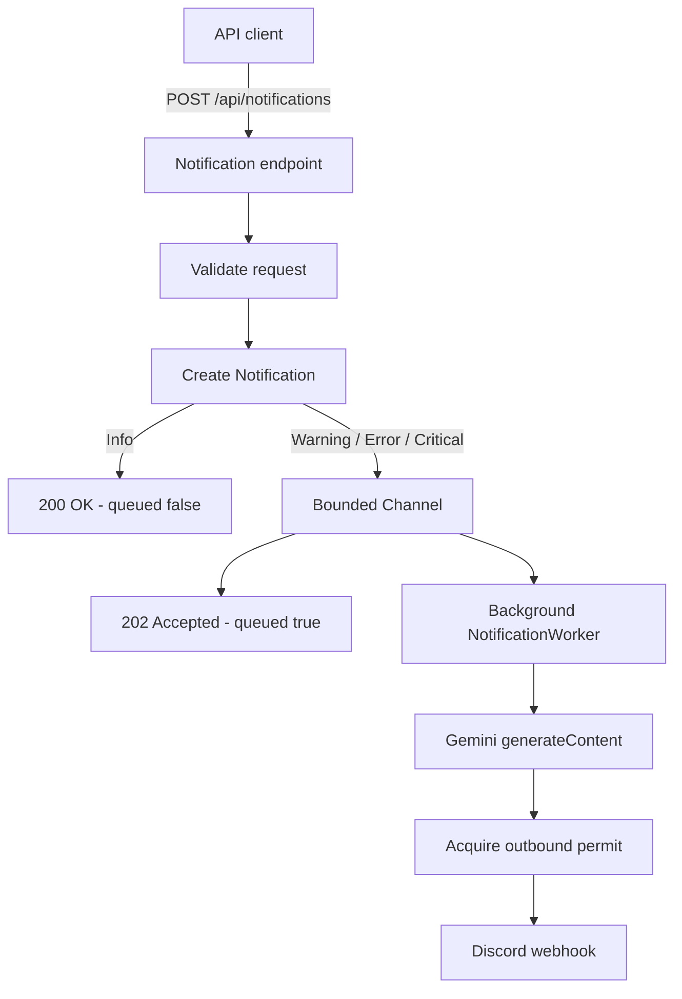

# Dymatrix.Notifications

An ASP.NET Core notification service that accepts operational messages, handles informational messages immediately, and asynchronously enriches and forwards warning-or-higher notifications to Discord.

## 1. Understanding the Ticket

The service exposes one notification endpoint with four supported levels: `info`, `warning`, `error`, and `critical`.

- `info` is accepted immediately and is not forwarded.
- `warning`, `error`, and `critical` are accepted into an asynchronous processing pipeline.
- Gemini classifies and rewrites forwarded notifications into a concise category and message.
- Discord receives the generated notification.
- Outbound Discord publishing is limited to 10 attempts per minute.

A `202 Accepted` response means the notification entered the in-memory queue. It does not claim that Gemini generation or Discord delivery has already succeeded.

## 2. Architecture and Reasoning

The solution uses four focused projects to keep business decisions separate from frameworks and external providers without introducing a mediator, database, message broker, or other infrastructure not required by the ticket.

- **Domain** contains `Notification`, `NotificationLevel`, and the rule that warning-or-higher notifications require forwarding.
- **Application** coordinates notification submission, validates commands, and depends on a queue abstraction.
- **Infrastructure** implements the bounded queue, background processing pipeline, Gemini and Discord adapters, and outbound rate limiter.
- **API** owns HTTP contracts, endpoint behavior, JSON configuration, Problem Details, OpenAPI, and dependency composition.

Dependency injection connects these layers at startup. External provider details do not leak into the API contract or application submission use case.

## 3. Processing Flow



The worker reads one notification at a time. For each forwarded notification it:

1. Requests structured JSON from Gemini.
2. Parses the generated `category` and `message`.
3. Acquires an outbound rate-limit permit.
4. Maps the result to Discord content.
5. Publishes through the Discord webhook.

Failures are logged and isolated per notification, allowing the worker to continue with the next queued item. There are intentionally no automatic retries, persistence, or dead-letter processing in this take-home implementation.

## 4. Queue and Rate-Limit Decisions

### Bounded queue

The service uses `System.Threading.Channels` with a default capacity of 100 and `BoundedChannelFullMode.Wait`.

This provides asynchronous producer/consumer behavior without introducing a broker. When the queue is full, the submitting request waits asynchronously for capacity rather than silently dropping a notification. Request cancellation can stop that wait.

The trade-off is that the queue is process-local and non-durable. Queued notifications are lost if the process stops. A production system requiring delivery guarantees would use a durable broker such as RabbitMQ or Azure Service Bus.

### Outbound rate limiting

A process-wide `SlidingWindowRateLimiter` allows 10 Discord publishing attempts per 60 seconds by default. The permit is acquired immediately before publishing to Discord, so the rule applies to the constrained outbound operation rather than incoming HTTP traffic.

Gemini runs before permit acquisition because its generated result is required by Discord. This keeps the requested pipeline simple, but under sustained load it can perform LLM work before waiting for Discord capacity. A larger production design could coordinate generation and publishing differently or persist generated results.

## 5. Project Structure

```text
.
├── src/
│   ├── Dymatrix.Notifications.Domain/
│   │   ├── Constants/
│   │   └── Models/
│   ├── Dymatrix.Notifications.Application/
│   │   ├── Abstractions/
│   │   ├── Extensions/
│   │   └── Notifications/Submit/
│   ├── Dymatrix.Notifications.Infrastructure/
│   │   ├── Abstractions/
│   │   ├── Extensions/
│   │   ├── ExternalProviders/
│   │   │   ├── Llm/Gemini/
│   │   │   └── Webhooks/Discord/
│   │   ├── Processing/
│   │   ├── Queue/
│   │   ├── RateLimiting/
│   │   └── Settings/
│   └── Dymatrix.Notifications.Api/
│       ├── Contracts/
│       ├── Endpoints/
│       ├── ErrorHandling/
│       └── Extensions/
├── tests/
│   ├── Dymatrix.Notifications.UnitTests/
│   └── Dymatrix.Notifications.IntegrationTests/
├── Dockerfile
├── compose.yaml
└── .env.example
```

Generated `bin/` and `obj/` directories, IDE settings, operating-system files, `.env`, and User Secrets are excluded from source control.

## 6. Prerequisites

- .NET 10 SDK
- A Gemini API key
- A Discord webhook URL
- Docker Desktop or another Docker Compose installation, only for container execution

## 7. Configure Gemini and Discord Securely

The repository contains no provider credentials. For local .NET execution, store them with .NET User Secrets:

```bash
dotnet user-secrets set "Gemini:ApiKey" "<your-gemini-api-key>" \
  --project src/Dymatrix.Notifications.Api

dotnet user-secrets set "Discord:WebhookUrl" "<your-discord-webhook-url>" \
  --project src/Dymatrix.Notifications.Api
```

Safe defaults remain in `appsettings.json`:

| Setting | Default | Purpose |
|---|---:|---|
| `NotificationQueue:Capacity` | `100` | Maximum buffered notifications |
| `OutboundRateLimit:PermitLimit` | `10` | Discord attempts per window |
| `OutboundRateLimit:WindowSeconds` | `60` | Sliding-window duration |
| `Gemini:BaseUrl` | Gemini v1beta API | Provider base address |
| `Gemini:Model` | `gemini-3.6-flash` | Configured generateContent model |

The Gemini model and base URL remain configuration-driven rather than hardcoded in the provider client.

## 8. Run Locally

Restore, build, and start the API:

```bash
dotnet restore
dotnet build
dotnet run --project src/Dymatrix.Notifications.Api
```

The included HTTP launch profile uses `http://localhost:5219`.

Check service health:

```bash
curl http://localhost:5219/health
```

Submit a forwarded notification:

```bash
curl --request POST http://localhost:5219/api/notifications \
  --header "Content-Type: application/json" \
  --data '{
    "level": "warning",
    "message": "Database connection pool exhausted"
  }'
```

Expected immediate response:

```http
HTTP/1.1 202 Accepted
```

```json
{
  "notificationId": "<guid>",
  "queued": true
}
```

An `info` notification returns `200 OK` with `queued: false`. Invalid JSON, unsupported levels, and missing messages return `400 Bad Request` using Problem Details.

## 9. API Documentation

When the application runs in Development:

- OpenAPI document: `http://localhost:5219/openapi/v1.json`
- Scalar UI: `http://localhost:5219/scalar`

Scalar shows the supported notification levels and the documented `200`, `202`, `400`, and `500` responses.

## 10. Run the Tests

```bash
dotnet test
```

The test suite focuses on behavior owned by the service:

- forwarding and validation decisions;
- bounded queue ordering, backpressure, and cancellation;
- worker continuation and shutdown behavior;
- Gemini and Discord request/response mapping;
- secret-safe provider failures;
- rate-limit acquisition and replenishment;
- HTTP validation and API-to-worker integration.

Automated tests replace external providers and do not call Gemini or Discord.

## 11. Run with Docker Compose

Copy the environment template and replace its placeholder values locally:

```bash
cp .env.example .env
```

```dotenv
GEMINI_API_KEY=<your-gemini-api-key>
DISCORD_WEBHOOK_URL=<your-discord-webhook-url>
GEMINI_MODEL=gemini-3.6-flash
HTTP_PORT=8080
```

Build and start the service:

```bash
docker compose up --build
```

The API is then available at `http://localhost:8080`. Stop and remove the container with:

```bash
docker compose down
```

`.env` is ignored by Git. Only `.env.example`, containing placeholders, is tracked. The multi-stage Dockerfile publishes the application in Release mode and runs it as the non-root .NET container user.
